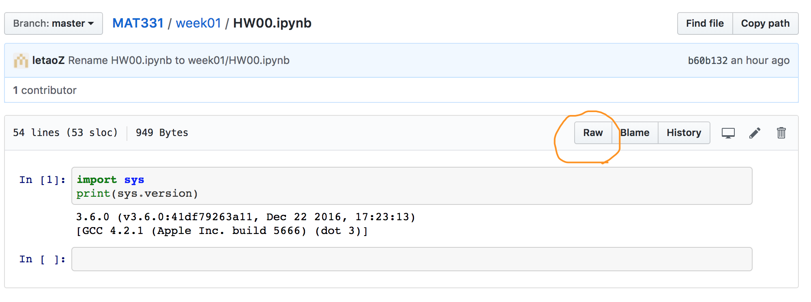
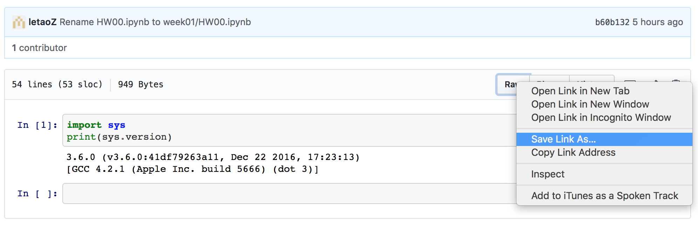

# Class Information

# Exam Schedule
    Final:
    Tue May 15, 11:15am-1:45pm 
    Final Exam Location: TBA
    
    Midterm: 
    - Tue Mar. 06 (in-class)

    Quiz (30 minutes each, in-class) schedule:
    - Tue Feb. 13
    - Tue Mar. 27
    - Tue Apr. 10
    - Tue Apr. 24

# class materials and HOMEWORK 

# Resources: -- can be found in the folder here or weekly folder
1. In weekly folders, you may find lab code and some .pdf files cover what we teach in class.
1. Best place to find programming related answers : https://stackoverflow.com/
1. Basic Python3.x (required), Chapter 1 - 10 in the tutorial: https://www.py4e.com/html3/01-intro
1. Probability: prerequisite of Grinstead: Chapter 1 - 7 https://math.dartmouth.edu/~prob/prob/prob.pdf
1. Probability: we will cover the rest of Grinstead
1. Data analysis and statistics, we will cover some of the following books  https://github.com/letaoZ/MAT331/blob/master/Advanced%20Data%20Analysis%20from%20an%20Elementary%20Point%20of%20View.pdf
1. Highly Recommended :we will NOT use R/Stan, but the stats part is useful
    1. Statistical Rethinking: A Bayesian Course with Examples in R and Stan by Richard McElreath.
    1. Bayesian Data Analysis, by Andrew Gelman, John Carlin, Hal Stern, David Dunson, Aki Vehtari, and Donald Rubin. 3rd Edition.
    
    
# Class materials and HOMEWORK can be found on github here or sequentially here  https://sites.google.com/site/letaoedu/teaching/spr18mat331/material. 

To download a file from github
1. click the file
1. right click "raw" button and choose "Save Link As"  
1. When you save the file, make sure that it is in the exact Format (the same extension, say .pdf, .ipynb, .txt, .dat, .csv, etc...)

# Office Hours:
* Instructor: Dr. Letao Zhang 
* Office Hour: Tuesday 1:30pm-2:30pm
* Location: Math Learning Center (Math Tower Room S-235)

# Office Hours:
* TA:  Mu Zhao (mu.zhao - at - stonybrook.edu )
* office hour: Tuesday 4:00pm-5:00pm 
* Location: Math Tower 2-122
* office hour: Tuesday 11:00am-11:30am
* Location: Math Learning Center (Math Tower Room S-235)
